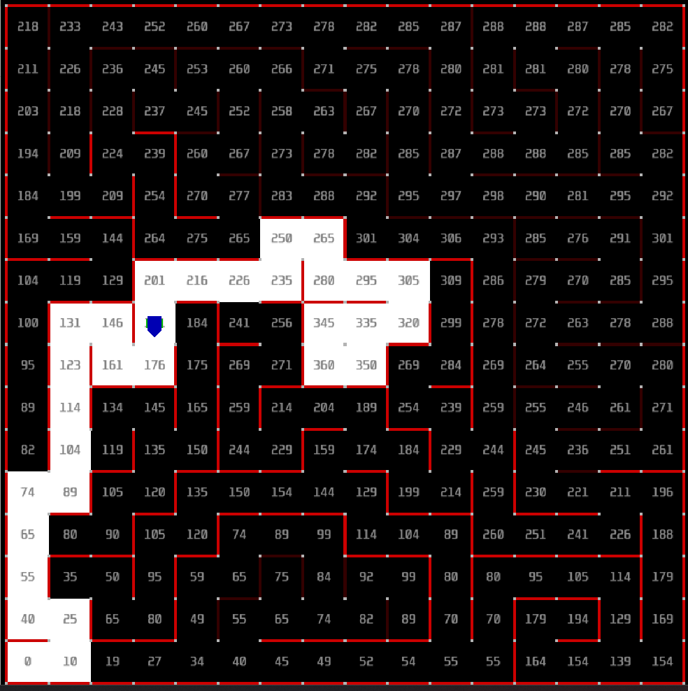
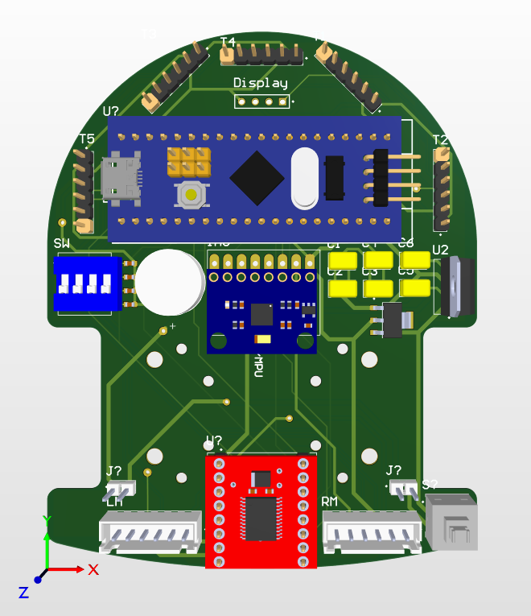
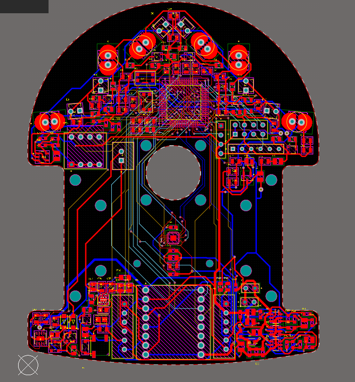
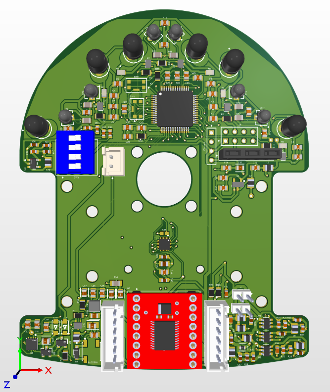

# Micromouse – Autonomous Maze-Solving Robot


## Overview

The Micromouse project is an autonomous robot designed to navigate and solve a 16x16 maze efficiently. It is built around two custom PCBs:

1. **Initial PCB**: Features a Time-of-Flight (ToF) sensor and an STM32 microcontroller.
2. **Main PCB**: Equipped with six infrared (IR) sensors and an STM32F405RGT microcontroller.

The robot employs advanced algorithms and sensor fusion to explore the maze and determine the optimal path to the center.

<div align="center">
 


</div>

---

## 🧠 Hardware Components

### Initial PCB

* **STM32 Microcontroller**: Serves as the central processing unit, handling sensor data and motor control.
* **ToF Sensor**: Provides precise distance measurements to detect obstacles and map the maze layout.

### Main PCB

* **STM32F405RGT Microcontroller**: Manages sensor data processing and communication with the main PCB.
* **Six IR Sensors**: Positioned around the robot to detect walls and assist in localization within the maze.

---

## 🔧 Software & Firmware

The firmware is developed using STM32CubeIDE and HAL libraries. It includes:

* **Sensor Drivers**: For interfacing with ToF and IR sensors.
* **Motor Control Algorithms**: To drive the robot through the maze.
* **Localization and Mapping**: Using sensor data to build a map of the maze.
* **Pathfinding Algorithms**: Implementing techniques like Flood Fill to find the shortest path.

---

## ⚙️ Getting Started

1. **Clone the Repository**:

   ```bash
   git clone https://github.com/Ravindu-Kuruppuarachchi/Micromouse.git
   cd Micromouse
   ```

2. **Set Up STM32CubeIDE**:

   * Open `Micromouse.ioc` in STM32CubeMX to configure the microcontroller settings.
   * Generate the initialization code and open the project in STM32CubeIDE.

3. **Build and Flash the Firmware**:

   * Compile the project in STM32CubeIDE.
   * Connect the STM32 microcontroller to your PC via ST-Link.
   * Flash the firmware onto the microcontroller.

4. **Testing**:

   * Assemble the robot with the PCBs and motors.
   * Place it in a 16x16 maze.
   * Power on the robot to begin autonomous navigation.

---

## 📁 Repository Structure

* `Core/`: Main application code.
* `Drivers/`: Hardware abstraction layer for peripherals.
* `Debug/`: Debugging configurations and scripts.
* `PCBs/`: Gerber files and design documents for the PCBs.
* `README.md`: This documentation.

---

## 📸 Gallery

<div align="center">

 


</div>


---

## 📄 License

This project is licensed under the MIT License - see the [LICENSE](LICENSE) file for details.

---

